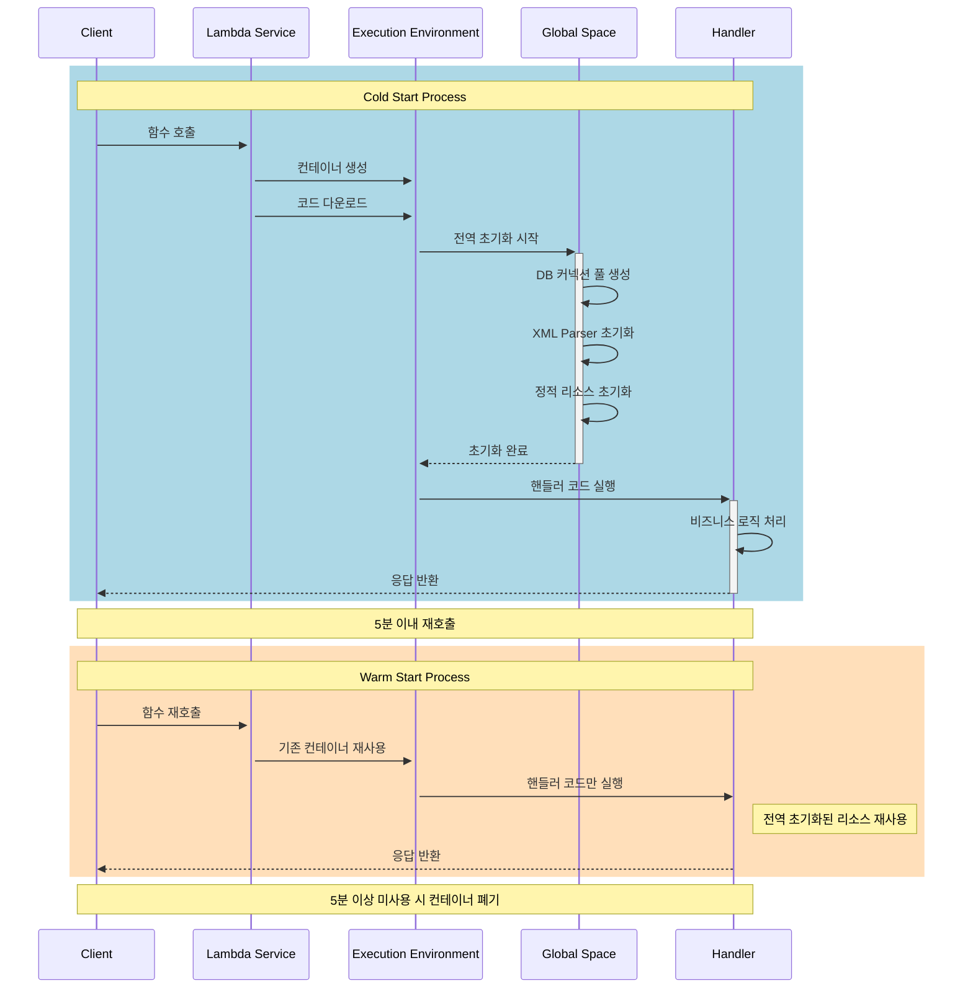

```mermaid
sequenceDiagram
    participant C as Client
    participant L as Lambda Service
    participant E as Execution Environment
    participant G as Global Space
    participant H as Handler
    
    rect rgb(173, 216, 230)
        Note over C,H: Cold Start Process
        C->>+L: 함수 호출
        L->>+E: 컨테이너 생성
        L->>E: 코드 다운로드
        
        E->>+G: 전역 초기화 시작
        G->>G: DB 커넥션 풀 생성
        G->>G: XML Parser 초기화
        G->>G: 정적 리소스 초기화
        G-->>-E: 초기화 완료
        
        E->>+H: 핸들러 코드 실행
        H->>H: 비즈니스 로직 처리
        H-->>-C: 응답 반환
    end
    
    Note over C,H: 5분 이내 재호출
    
    rect rgb(255, 223, 186)
        Note over C,H: Warm Start Process
        C->>L: 함수 재호출
        L->>E: 기존 컨테이너 재사용
        E->>H: 핸들러 코드만 실행
        Note right of H: 전역 초기화된 리소스 재사용
        H-->>C: 응답 반환
    end
    
    Note over C,H: 5분 이상 미사용 시 컨테이너 폐기
```
